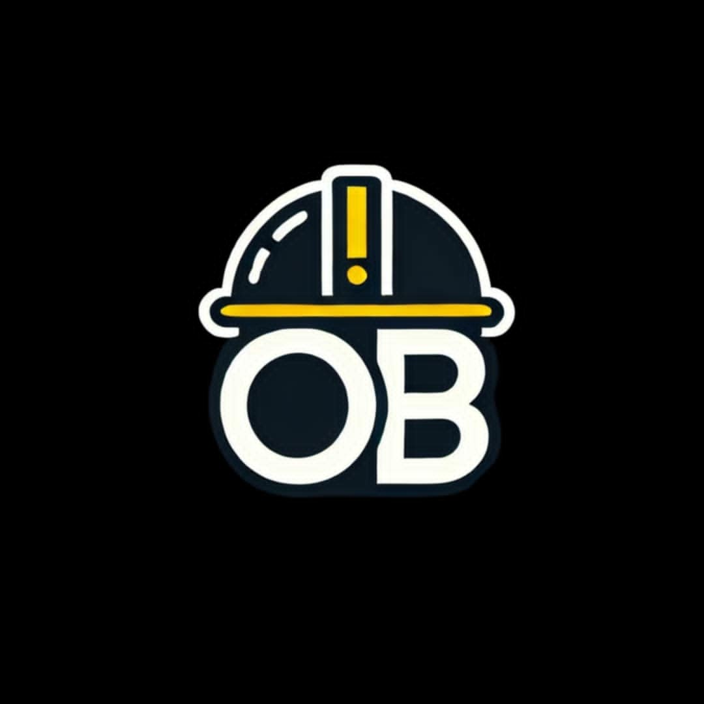

<p align="center">
  
</p>


## 🎥 Vidéo de Présentation

👉 [Cliquez ici pour voir la vidéo de présentation du projet OUR BATIMA ](https://vimeo.com/manage/videos/1089055324/0db36b06d5)


# OUR BATIMA - Application JavaFX (Client de Gestion de Projets de Construction)

## 🎯 Présentation

**OUR BATIMA** est une application **JavaFX Desktop** développée dans le cadre du projet PIDEV 3A à **Esprit School of Engineering** (Année universitaire 2024-2025).  
Elle permet la **gestion intelligente des projets de construction**, en facilitant la coordination entre les différents acteurs (clients, artisans, constructeurs, gestionnaires, etc.).

Cette version de l'application est un **client JavaFX** qui communique avec une base de données MySQL via **JDBC**, sans passer par une API HTTP.

---

## ✅ Fonctionnalités principales

- 🔐 Authentification & inscription des utilisateurs
- 👤 Gestion des utilisateurs (CRUD pour clients, artisans, etc.)
- 👤 Gestion des Equipe (Drag and drop )
- 🏗️ Suivi des projets, étapes, tâches
- 📆 Planification des interventions
- 📄 Rapports, visites & terrain
- 📦 Gestion du stock et des matériaux
- 💰 Gestion financière (contrats, paiements)
- 🛠️ Interface graphique moderne et responsive avec JavaFX

---

## 🧱 Architecture du Projet

```
OurBatimaJavaFX/
│
├── src/
│   ├── main/
│   │   ├── java/
│   │   │   └── io/ourbatima/
│   │   │       ├── controller/         # Contrôleurs JavaFX (gestion UI)
│   │   │       ├── core/         # Contrôleurs JavaFX (gestion UI)
│   │   │        ├── dao/                # Accès base de données via JDBC
│   │   │        ├── model/              # Entités/metier (Utilisateur, Projet, etc.)
│   │   │        └── util/               # Utilitaires (connexion DB, validation...)
│   │   └── resources/
│   │       ├── fxml/                   # Interfaces graphiques (FXML)
│   │       ├── img/                    # Images (logo, icônes, etc.)
│   │       └── style/                  # Feuilles de styles CSS
├── build.gradle
├── settings.gradle
└── README.md
```

---

## ⚙️ Technologies Utilisées

- ✅ **JavaFX 18**
- ✅ **Gradle** (build automation)
- ✅ **JDBC** pour les opérations avec MySQL
- ✅ **IntelliJ IDEA**
- ✅ **MySQL 8+**
---

## 📚 Modules & Entités

### 1. Gestion des utilisateurs
- `Utilisateur`: id, nom, prénom, email, téléphone, mot de passe, adresse, rôle, statut, isConfirmed
- Héritage Java (Client, Artisan, Constructeur, etc.)
    - Spécialité et salaire pour les artisans/constructeurs

### 2. Projets et Tâches
- `Projet`, `EtapeProjet`, `Tache`, `Planification`
- Suivi par dates, statuts et montants

### 3. Terrain & Visites
- `Terrain`: emplacement, superficie, détails
- `Visite` et `Rapport` de suivi

### 4. Gestion des Réclamations
- `Reclamation` et `Reponse`

### 5. Gestion de Stock
- `Stock`, `Article`, `Materiel`

### 6. Gestion Financière
- `Paiement` et `Contrat`

---

## 🧪 Prérequis

- Java JDK 18
- IntelliJ IDEA (ou tout IDE compatible JavaFX)
- Gradle (inclus avec IntelliJ)
- Serveur MySQL en local (ou distant)

---

## 🚀 Démarrage Rapide

### 1. Cloner le projet
```bash
git clone https://https://github.com/wael-ben-salem/OBatimaPi
cd OBatimaPi
```

### 2. Configurer la base de données (MySQL)

Crée une base `ourbatimapi` et configure les tables comme dans ton projet Symfony (ou exporte un dump depuis Symfony).

### 3. Modifier la configuration JDBC

Dans `src/main/java/io/ourbatima/util/Database.java` (ou un fichier équivalent), configure :
```java
private static final String URL = "jdbc:mysql://localhost:3306/ourbatimapi";
private static final String USER = "root";
private static final String PASSWORD = "";
```

### 4. Lancer le projet

Dans IntelliJ :
- Ouvre le projet
- Assure-toi que JavaFX est configuré dans les modules
- Lance la classe `Main.java` (ou `App.java`) contenant le `Application.launch(...)`

---

## 📸 Interface (exemples FXML)

- Page de connexion (`Login.fxml`)
- Dashboard utilisateur (`Dashboard.fxml`)
- Ajout/modification utilisateur (`UserForm.fxml`)
- Suivi de projet (`ProjectView.fxml`)
- Stock & matériaux (`StockView.fxml`)

---

## ❗ Conseils

- Utilise **FXML** pour structurer tes interfaces (liées à des `Controller.java`)
- Utilise des **DAO** pour l’accès aux données (ex : `UtilisateurDAO`)
- Utilise un `DBConnection` central pour gérer la connexion
- Tu peux intégrer des **animations JavaFX** ou des **bibliothèques CSS** pour améliorer l'UX

---

## 🧑‍🏫 Références pédagogiques

Ce projet a été réalisé sous la supervision de **Mr Akram Khemiri** et **Mr Mohamed Islem Samaali**   dans le cadre du module **PIDEV** à **Esprit School of Engineering**.

---

## 📄 Licence

Ce projet est à but pédagogique uniquement. Toute utilisation commerciale est interdite sans autorisation.

---

## 📬 Contact

Développé par : **Groupe n°6 - Esprit 3A PIDEV**  
Pour toute question ou collaboration, contactez-nous sur GitHub ou par email.
